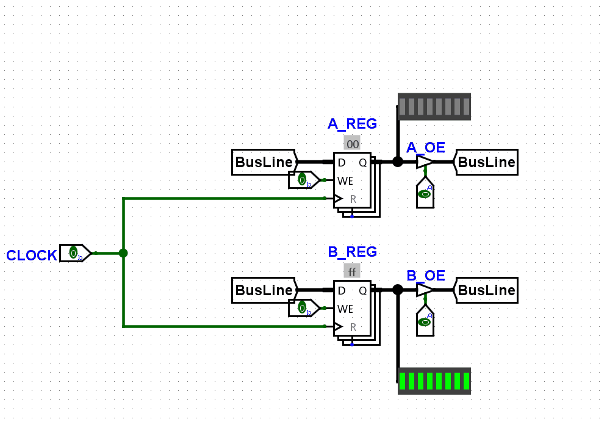

# How It All Works

Each "module" that the computer is made up with is only there to do one thing: 

Read and write to the bus.

That's all. What makes it special is which ones are reading and writing and at what times. For example, if the B register is writing to the bus and the A register is reading it, the value of the B register will be transferred to the A register. If we wire up the ALU so that the A register is always one operand and the bus is another, then we can make it so that the ALU is reading from the bus. That would store the result in its internal register to be used later. After that, we might want the ALU to output its last result and have the B register take input. 

All those individual controls (Like write enable, output enable, etc) are called "microinstructions" and it's easy to see why. Individually, they can't do a whole lot on their own, but combined with others they can be very powerful.

## What does the Control Unit do?

The control unit is the governing body of all the modules. It decides which microinstructions ones to activate, and which ones to disable based on the current instruction being processed. For example, the instruction "swap" might load the value of the A register into the B register by using the Load_B, and Output_A microinstructions. 

But how does it know what to activate? Well, it's quite simple really, the current instruction is fed into the control unit as two bytes. One for the opcode (the ID of the instruction) and the 8-bit memory address it's operating on. It also has a counter called something like the t-value which determines which step of the instruction is being executed. It then feeds the opcode and t-value into a ROM that is pre-programmed with all the microinstructions necessary to run the command[1](#notes).

That's just one instruction though. To actually get the instructions from the program the control unit also keeps a program counter that cycles through a ROM that contains the program. 

All these pieces together (and some more small stuff) creates a super minimal CPU that's capable of running a program. 
