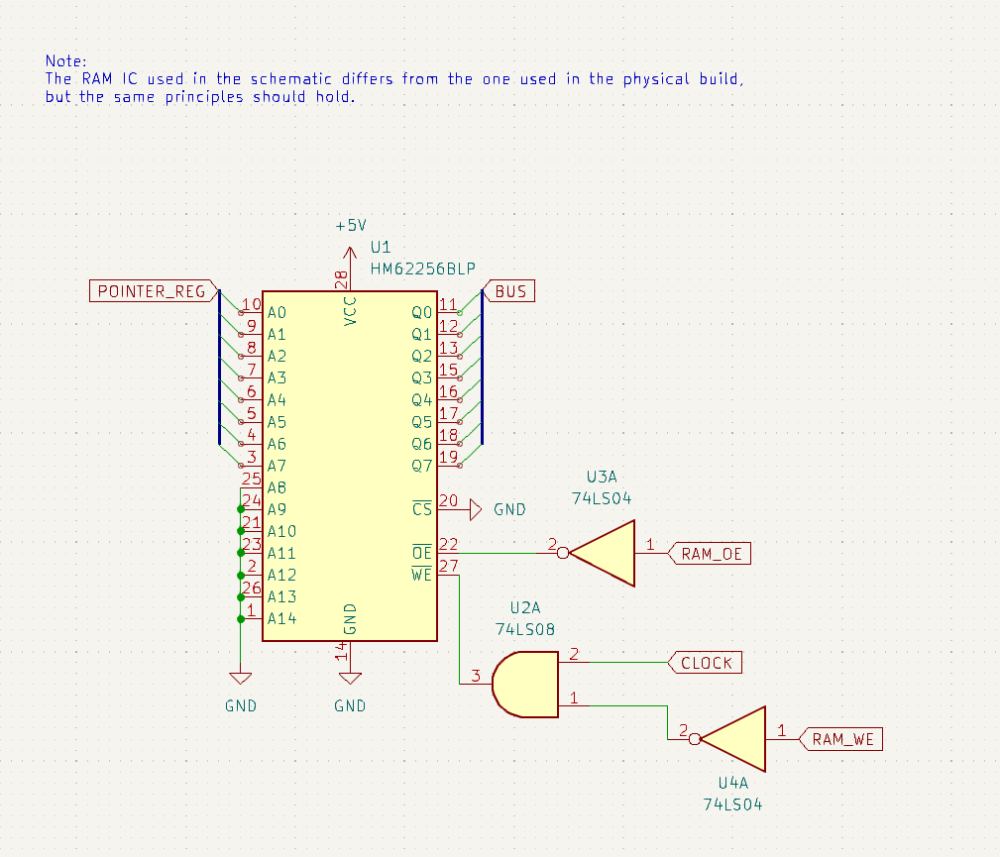

# RAM Module

This is just what you'd expect. It's the part of the computer responsible for the memory. In the computer it's going to have 8-bit addressing to allow for a total of 256 memory locations (I know, not a lot. If anyone has ideas on how to expand to the full 2^15 odd locations that'd be awesome!*).

*As i'm writing this I thought of the possibility of extending the length of each instruction to 3 bytes. One for the opcode + options, another for the low 8 address bits and another for the higher address bits. 